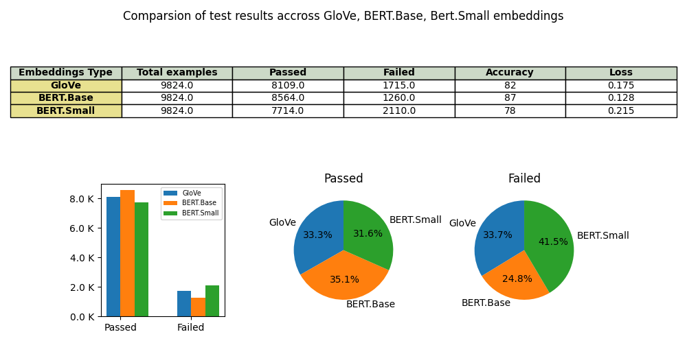

### Using Natural Language Inference to check whether one text sentence can be inferred form another.

**Rama Viswanatha G Ayyagari**

#### Executive summary

**Project overview and goals:** The goal of this project is to provide two solutions, `Natural Language Inference with Attention` and `Natural Language Inference with Fine Tuning BERT` to check whether one text sentence can be inferred form another, compare and evaluate results. The solutions consists of pretrained large corpos of text data to represent input text sentence tokens that are feed to a deep learning based `MLP(Multi Layer Perceptrons)` architecture. We use pretrainned 100-dimensional `GloVe`, `BERT small` and `BERT base` word embeddings and that are feed to `Decomposable Attention model` and `Fine Tuning BERT model` to train and evaluate performance.

**Findings:** The best solution to check whether one text sentence can be inferred form another is `Fine Tuning BERT model` with `BERT.base` embeddings with accuracy score of 87% on test dataset, followed by `with Attention model` with `GloVe` embeddings with 82% accuracy and then by `BERT.small` with 78% accuracy.

**Results and conclusion:** Apart from good accuracy of results on test data the `Fine Tuning BERT model` with `BERT small` and `BERT base` word embeddings are also context-senstive and sequence-level test pair classification solutions.

#### Rationale
Natural language inference is central for understanding natural language. It has wide applications ranging from information retrieval to open-domain question answering.

#### Research Question
When presented with two text sequences, `premises` and `hypothesis`, the expected result, either one of `entailment`, `contradiction` or `neutral` based on logical semantic relation between the `premises` and `hypothesis`.

##### Entailment: the hypothesis can be inferred from the premise.
    Premise: Two women hugging each other.
    Hypothesis: Two women are showing affection.
##### Contradiction: the negation of hypothesis can be inferred from premise.
    Premise: A man is running code example
    Hypothesis: The man is sleeping
##### Neutral: all other cases
    Premise: The musicians are performing for us.
    Hypothesis: The musicians are famous.

#### Data Sources

**Dataset:** The Stanford Natural Language Inference (SNLI) dataset used in this project and can be accessed at 'https://nlp.stanford.edu/projects/snli/snli_1.0.zip'. The training set has about 550000 labeled english sentence pairs, and the testing set has about 10000 labeled english sentence pairs. Each english sentence pair is labeled with `0`, `1` and `2` for `entailment`, `contradiction`, and `neutral` classes respectively.

549367 samples from the training dataset is used for model training. And 9824 samples from test data set to validate model performance. 

**Exploratory data analysis:** There are no null values in this data, and the maximum length of text sentence is about 150 characters.

**Cleaning and preparation:** Not relavent folders and files has been removed from the extracted SNLI dataset. The labeled english sentence pairs `entailment`, `contradiction`, and `neutral` are balanced in both the training set and the testing set. In the training dataset the count of `entailment`, `contradiction`, and `neutral` samples are `183416`, `183187`, `182764` and in test dataset `3368`, `3237`, `3219` respectively.

**Preprocessing:** To understand text, we need to learn its representations. By leaveraging the existing text sentences from large corpora, we can pretrain text representations using self-supervised learning models. In this project, we leveraged `100-Dimensional Glove`, `BERT.small` and `BERT.base` pretrained word embeddings on trained on `wikipedia subset` and `BookCorpus and English Wikipedia` corpora respectively.

**Final Dataset:** The final dataset consists of cleaned Stanford Natural Language Inference (SNLI) with `entilement`, `contradiction` and `neutral` classes are labeled as `0`, `1`, and `2` respectively and pretrained `100-Dimensional Glove`, `BERT.small` and `BERT.base` word embeddings.

#### Methodology

**Natural Language Inference with Attention (Decomposable Attention Model):** At a high level, it consists of three jointly trained steps: `Attending`, `Comparing` and `Aggregating`. In `Attending` step, we align tokens in one text sequence to each token in the other sequence. This alignment is `soft` using weighted average. In `soft` alignment, all the tokens from one sequence, though with probably different attention weights, will be compared with a token in the other sequence. In `Comparing` step, we feed the concatination of tokens from one sequence with aligned tokens from the other sequence into a function `MLP(Multi Layer Perceptrons)`. In `Aggregating` step, we agggregate these two comparison vectors, to infer logical symantic relationship. we feed the concatenation of both summarization results into function `MLP(Multi Layer Perceptrons)` to obtain the classification result of the logical relationship. refer [Attention](ATTENTION.md) for more details.

**Natural Language Inference with Fine-tuning BERT:** At a high level, the steps are loading pretrained BERT model (`bert.small` or `bert.base`), prepare SNLI dataset for BERT Model and finally fine-tuning BERT. During fine-tuning, the BERT model becomes part of the model of Natural Language Interence. Parameters that are only related to pretraining loss will not be updated during fine-tuning. 

#### Next steps
1. Extend the solution to provide `semantic textual similarity` (i.e a continuous value between 0 and 1) for a pair of text sentences.
2. Perform more evaluation of results sub-category wise, i.e whether the solution performs better or worest in each of the `entailment`, `contradiction` or `neutral` categories across two solutions.

#### Outline of project

- [Natural Language Inference](nli.ipynb)
- [Utility functions library](utilities.ipynb)
- [Installation](INSTALLATION.md)

##### Contact and Further Information

Rama Viswanatha G Ayyagari

Email: gouri.ayyagari@gmail.com 

[LinkedIn](https://www.linkedin.com/in/ramaayyagari/)